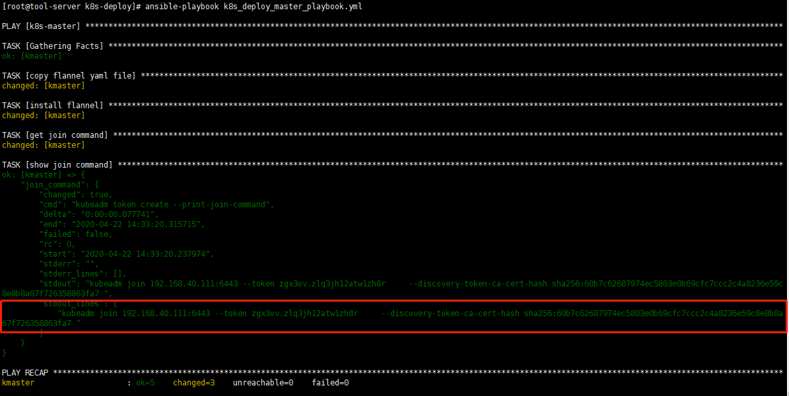
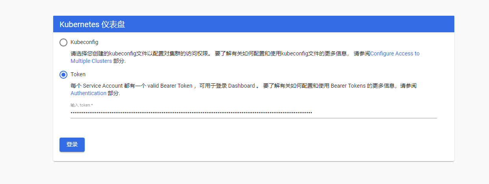

# 采用Ansible安装K8s

## 一. 准备服务器节点

如果还没有服务器，可以参考 [ubuntu18.04上搭建KVM虚拟机环境超完整过程](http://blog.jboost.cn/ubuntu-kvm.html) 创建虚拟服务器。

服务器节点IP（hostname）：

- 192.168.40.111 (kmaster)
- 192.168.40.112 (knode1)
- 192.168.40.113 (knode2)
- 192.168.40.114 (knode3)

操作系统版本：

* `cat /etc/redhat-release` : CentOS Linux release 7.6.1810 (Core)
* `uname -a` : 3.10.0-957.el7.x86_64

## 二. 配置Ansible

如果还没有Ansible环境，可以参考 [Ansible简明教程](http://blog.jboost.cn/ansible.html) 搭建。

1. 在Ansible服务器上的/etc/hosts文件中添加k8s服务器节点信息(参考 [hosts](./basic/hosts))

```shell
192.168.40.111 kmaster
192.168.40.112 knode1
192.168.40.113 knode2
192.168.40.114 knode3
```


2. 在Ansible服务器上的/etc/ansible/hosts文件中添加k8s服务器节点（参考 [ansible_hosts](./basic/ansible_hosts)）

```shell
[k8s-all]
kmaster
knode1
knode2
knode3

[k8s-master]
kmaster

[k8s-nodes]
knode1
knode2
knode3
```

## 三. 修改k8s集群各节点/etc/hosts（非必须）

修改所有主机/etc/hosts文件，添加IP/主机名映射，方便通过主机名ssh访问

1. 创建playbook文件（参考 [set_hosts_playbook.yml](./basic/set_hosts_playbook.yml)）

```shell
vim set_hosts_playbook.yml
---
- hosts: k8s-all
  remote_user: root
  
  tasks:
    - name: backup /etc/hosts
      shell: mv /etc/hosts /etc/hosts_bak

    - name: copy local hosts file to remote
      copy: src=/etc/hosts dest=/etc/ owner=root group=root mode=0644 
```

2. 执行ansible-playbook

```shell
ansible-playbook set_hosts_playbook.yml
```


## 四. 安装Docker

在所有主机上安装Docker

1. 创建playbook文件（参考 [install_docker_playbook.yml](./basic/install_docker_playbook.yml)）

```shell
vim install_docker_playbook.yml
- hosts: k8s-all
  remote_user: root
  vars: 
     docker_version: 18.09.2

  tasks: 
     - name: install dependencies
       #shell: yum install -y yum-utils device-mapper-persistent-data lvm2 
       yum: name={{item}} state=present
       with_items:
          - yum-utils
          - device-mapper-persistent-data
          - lvm2

     - name: config yum repo
       shell: yum-config-manager --add-repo https://mirrors.ustc.edu.cn/docker-ce/linux/centos/docker-ce.repo

     - name: install docker
       yum: name=docker-ce-{{docker_version}} state=present

     - name: start docker
       shell: systemctl enable docker && systemctl start docker
```

2. 执行ansible-playbook

```shell
ansible-playbook install_docker_playbook.yml
```


## 五. 部署k8s master

1. 开始部署之前，需要做一些初始化处理：关闭防火墙、关闭selinux、禁用swap、配置k8s阿里云yum源等，所有操作放在脚本 [pre-setup.sh](./basic/pre-setup.sh) 中，并在2中playbook中通过script模块执行

2. 创建playbook文件 [deploy_master_playbook.yml](./basic/deploy_master_playbook.yml)，只针对master节点，安装kubectl，kubeadm，kubelet，以及flannel（将kube-flannel.yml文件里镜像地址的quay.io改为quay-mirror.qiniu.com避免超时，参考 [kube-flannel.yml](./basic/kube-flannel.yml)）

```shell
vim deploy_master_playbook.yml
- hosts: k8s-master
  remote_user: root：q
  vars:
    kube_version: 1.16.0-0
    k8s_version: v1.16.0
    k8s_master: 192.168.40.111 
  
  tasks:
    - name: prepare env
      script: ./pre-setup.sh      

    - name: install kubectl,kubeadm,kubelet
      yum: name={{item}} state=present
      with_items:
        - kubectl-{{kube_version}}
        - kubeadm-{{kube_version}}
        - kubelet-{{kube_version}}
    
    - name: init k8s
      shell: kubeadm init --image-repository registry.aliyuncs.com/google_containers --kubernetes-version {{k8s_version}} --apiserver-advertise-address {{k8s_master}}  --pod-network-cidr=10.244.0.0/16 --token-ttl 0
    
    - name: config kube
      shell: mkdir -p $HOME/.kube && cp -i /etc/kubernetes/admin.conf $HOME/.kube/config && chown $(id -u):$(id -g) $HOME/.kube/config
    
    - name: copy flannel yaml file
      copy: src=./kube-flannel.yml dest=/tmp/ owner=root group=root mode=0644 
    
    - name: install flannel
      shell: kubectl apply -f /tmp/kube-flannel.yml

    - name: get join command
      shell: kubeadm token create --print-join-command 
      register: join_command
    - name: show join command
      debug: var=join_command verbosity=0
```

3. 执行ansible-playbook

```shell
ansible-playbook deploy_master_playbook.yml
```

4. 上述命令执行完成会输出节点加入k8s集群的命令，如下图。记下该命令，后面部署node时会用到




## 六. 部署k8s node

1. 同master一样，开始部署之前，需要做一些初始化处理：关闭防火墙、关闭selinux、禁用swap、配置k8s阿里云yum源等，所有操作放在脚本  [pre-setup.sh](./basic/pre-setup.sh) 中，并在2中playbook中通过script模块执行

2. 创建playbook文件 [deploy_nodes_playbook.yml](./basic/deploy_nodes_playbook.yml)，针对除master外的其它集群节点，安装kubeadm，kubelet，并将节点加入到k8s集群中，使用的是前面部署master时输出的加入集群命令

```shell
vim deploy_nodes_playbook.yml
- hosts: k8s-nodes
  remote_user: root
  vars:
     kube_version: 1.16.0-0

  tasks:
    - name: prepare env
      script: ./pre-setup.sh

    - name: install kubeadm,kubelet
      yum: name={{item}} state=present
      with_items:
        - kubeadm-{{kube_version}}
        - kubelet-{{kube_version}}
    
    - name: start kubelt
      shell: systemctl enable kubelet && systemctl start kubelet
   
    - name: join cluster
      shell: kubeadm join 192.168.40.111:6443 --token zgx3ov.zlq3jh12atw1zh8r --discovery-token-ca-cert-hash sha256:60b7c62687974ec5803e0b69cfc7ccc2c4a8236e59c8e8b8a67f726358863fa7
```

3. 执行ansible-playbook

```shell
ansible-playbook deploy_nodes_playbook.yml
```

4. 稍等片刻，即可在master节点上通过`kubectl get nodes`看到加入到集群中的节点，并且status为Ready状态，如下
```shell
[root@kmaster ~]# kubectl get nodes
NAME      STATUS   ROLES    AGE     VERSION
kmaster   Ready    master   37m     v1.16.0
knode1    Ready    <none>   7m1s    v1.16.0
knode2    Ready    <none>   7m1s    v1.16.0
knode3    Ready    <none>   4m12s   v1.16.0
```

至此，k8s集群基本部署完成。接下来可安装Ingress与Dashboard。


## 七. 安装Ingress

Ingress为集群内服务提供外网访问，包括基于Nginx与Traefik两个版本，这里使用比较熟悉的Nginx版本。安装Ingress的操作在master节点进行（因为前面在master节点安装并配置了kubectl，也可在其它安装并配置好了kubectl的节点进行）

1. 下载yaml文件（此目录已包含 [nginx-ingress.yaml](./ingress/nginx-ingress.yaml)，并修改了镜像地址，可直接进入第3步） 

```shell
wget -O nginx-ingress.yaml https://raw.githubusercontent.com/kubernetes/ingress-nginx/master/deploy/static/provider/baremetal/deploy.yaml
```

2. 将里面的quay.io修改为quay-mirror.qiniu.com，避免镜像拉取超时。同时在nginx-ingress-controller的Deployment上添加hostNetwork为true及nginx-ingress的标签，以使用宿主机网络与控制Ingress部署的节点

```shell
vim nginx-ingress.yaml
:s/quay.io/quay-mirror.qiniu.com/g


vim nginx-ingress.yaml

    spec:
      hostNetwork: true
      nodeSelector:
        nginx-ingress: "true"
```


3. 部署Ingress

首先在knode1节点上打标签nginx-ingress=true，控制Ingress部署到knode1上，保持IP固定。

```shell
[root@kmaster k8s-deploy]# kubectl label node knode1 nginx-ingress=true
node/knode1 labeled
```

然后完成nginx-ingress的部署

```shell
kubectl apply -f nginx-ingress.yaml
```

4. 部署完成，稍等片刻等Pod创建完成，可通过如下命令查看ingress相关Pod情况

```shell
[root@kmaster k8s-deploy]# kubectl get pods -n ingress-nginx -o wide
NAME                                        READY   STATUS      RESTARTS   AGE   IP               NODE     NOMINATED NODE   READINESS GATES
ingress-nginx-admission-create-drpg5        0/1     Completed   0          79m   10.244.2.2       knode1   <none>           <none>
ingress-nginx-admission-patch-db2rt         0/1     Completed   1          79m   10.244.3.2       knode3   <none>           <none>
ingress-nginx-controller-575cffb49c-4xm55   1/1     Running     0          79m   192.168.40.112   knode1   <none>           <none>
```

## 八. 安装Kubernetes Dashboard

1. 下载yaml文件（此目录已包含 [kubernetes-dashboard.yaml](./dashboard/kubernetes-dashboard.yaml) 文件，可直接进入第3步）

```shell
wget -O kubernetes-dashboard.yaml  https://raw.githubusercontent.com/kubernetes/dashboard/v2.0.0-beta5/aio/deploy/recommended.yaml
```

2. 修改kubernetes-dashboard.yaml

将Service type改为NodePort，使得可通过IP访问Dashboard。注释掉默认的Secret（默认的secret权限很有限，看不到多少数据）

```yaml
kind: Service
apiVersion: v1
metadata:
  labels:
    k8s-app: kubernetes-dashboard
  name: kubernetes-dashboard
  namespace: kubernetes-dashboard
spec:
  type: NodePort
  ports:
    - port: 443
      targetPort: 8443
      nodePort: 30443
  selector:
    k8s-app: kubernetes-dashboard
```

3. 部署Dashboard，并创建绑定cluster-admin角色的ServiceAccount —— admin-user (参考 [auth.yaml](./dashboard/kubernetes-dashboard-auth.yaml))

```shell
kubectl apply -f kubernetes-dashboard.yaml
kubectl apply -f kubernetes-dashboard-auth.yaml
```

4. 访问Dashboard

访问 https://集群任意节点IP:30443，打开Dashboard登录页面，执行如下命令获取登录token

```shell
kubectl -n kubernetes-dashboard describe secret $(kubectl -n kubernetes-dashboard get secret | grep admin-user | awk '{print $1}')
```

使用token完成登录，如图




## 九. 解决证书无效问题

安装完后，默认的证书可能无效，在Chrome浏览中无法打开Dashboard，可通过重新生成证书解决。

1. 创建自定义证书 

```shell
[root@kmaster ~]# cd /etc/kubernetes/pki/
#生成私钥
[root@kmaster pki]# openssl genrsa -out dashboard.key 2048
#生成证书
[root@kmaster pki]# openssl req -new -key dashboard.key -out dashboard.csr -subj "/O=JBST/CN=kubernetes-dashboard"
#使用集群的CA来签署证书
[root@kmaster pki]# openssl x509 -req -in dashboard.csr -CA ca.crt -CAkey ca.key -CAcreateserial -out dashboard.crt -days 3650
#查看自创证书
[root@kmaster pki]# openssl x509 -in dashboard.crt -noout -text
```

注释 [kubernetes-dashboard.yaml](./dashboard/kubernetes-dashboard.yaml) 中默认的Secret，

```yaml
#---
#
#apiVersion: v1
#kind: Secret
#metadata:
#  labels:
#    k8s-app: kubernetes-dashboard
#  name: kubernetes-dashboard-certs
#  namespace: kubernetes-dashboard
#type: Opaque
```

重新部署Dashboard，并通过自定义证书创建新的Secret

```shell
[root@kmaster k8s-deploy]# kubectl delete -f kubernetes-dashboard.yaml
[root@kmaster k8s-deploy]# kubectl apply -f kubernetes-dashboard.yaml 
[root@kmaster k8s-deploy]# kubectl create secret generic kubernetes-dashboard-certs --from-file=dashboard.crt=/etc/kubernetes/pki/dashboard.crt --from-file=dashboard.key=/etc/kubernetes/pki/dashboard.key  -n kubernetes-dashboard
```

## 十. 在本地（win10）管理k8s集群

1. 下载kubectl windows版本： https://storage.googleapis.com/kubernetes-release/release/v1.16.0/bin/windows/amd64/kubectl.exe

2. 将kubectl.exe文件所在目录加入系统环境变量的Path中

3. 将master节点上 /etc/kubernetes/admin.conf 的内容拷贝到本地用户目录的 .kube/config 文件中，如 `C:\Users\Administrator\.kube\config`

4. 验证

```shell
C:\Users\Administrator>kubectl get nodes
NAME      STATUS   ROLES    AGE     VERSION
kmaster   Ready    master   4d19h   v1.16.0
knode1    Ready    <none>   4d19h   v1.16.0
knode2    Ready    <none>   4d19h   v1.16.0
knode3    Ready    <none>   4d19h   v1.16.0
```

---

作者：雨歌 
请关注作者微信公众号：半路雨歌，支持作者持续创作，一起学习成长  


